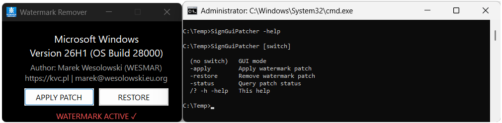

# SignGuiPatcher

**Windows desktop watermark remover for evaluation, insider and test-signing builds — Vista through Windows 11 Build 28000**

> Deploys a COM-hijacked proxy DLL (`ExpIorerFrame.dll`) that patches shell32.dll's Import Address Table
> at runtime, intercepting all rendering paths used by `CDesktopWatermark::s_DesktopBuildPaint`
> to suppress every desktop watermark string without touching any system file.
> Built in pure MASM x64. Zero CRT. Fully reversible.



---

## The Problem

Windows displays desktop watermarks in the bottom-right corner of the screen in several scenarios:

- **Test Signing Mode** — `bcdedit /set testsigning on` (unsigned drivers)
- **Evaluation builds** — trial/demo editions of Windows
- **Insider / pre-release builds** — build number + branch strings
- **Activation strings** — "Activate Windows" reminders on unlicensed installs

All watermarks are rendered by `shell32!CDesktopWatermark::s_DesktopBuildPaint`, a single function
called during desktop composition. On older builds (Vista–Win10) it uses GDI `ExtTextOutW`;
on modern builds (Win11 26H1 / Build 28000+) it routes through `UxTheme!DrawTextWithGlow`
(ordinal 126) for the glow effect. The tool intercepts every known rendering path.

---

## Debugging Session

### Step 1 — Locating the watermark renderer in shell32.dll

Symbols were loaded and the desktop watermark class was identified:

```
x shell32!CDesktopWatermark::*
```

Key methods:

```
shell32!CDesktopWatermark::s_DesktopBuildPaint
shell32!CDesktopWatermark::s_IsTestSigningEnabled
shell32!CDesktopWatermark::s_GetTestModeString
shell32!CDesktopWatermark::s_GetProductBuildString
```

`s_DesktopBuildPaint` is the root painter — it assembles all strings and calls the render API.
Breaking on it confirmed it fires on every desktop repaint containing a watermark.

### Step 2 — Disassembling s_DesktopBuildPaint on Build 28000

The function opens with a call to `BrandingLoadStringForEdition` (from `winbrand.dll`):

```asm
call    qword ptr [shell32+0x753C48]   ; BrandingLoadStringForEdition (delay IAT slot)
test    eax, eax
je      +0x9ED                          ; if result == 0 → skip edition string
```

Initial hypothesis: returning 0 from `BrandingLoadStringForEdition` would cause an early exit
at `je +0x9ED` and bypass all rendering.

**This was wrong.** Tracing the jump target revealed it does NOT skip rendering — it only zeroes
the edition string buffer and falls through to `s_GetProductBuildString` at `+0x102`,
which assembles the build number + branch string and proceeds to `DrawTextWithGlow`.

"Windows 11 Pro" disappeared from the watermark, but "Test Mode" and "Build 28000…" remained.

### Step 3 — Finding DrawTextWithGlow as the actual renderer

WinDbg was used to inspect the shell32 delay-load import table for UxTheme:

```
dq SHELL32+753AB0 L1         ; IAT slot — holds current function pointer
ln poi(SHELL32+753AB0)       ; resolve symbol
```

Result: `UxTheme!DrawTextWithGlow` — ordinal 126.

Every watermark string (Test Mode, build number, activation text) is rendered through this
single call. `ExtTextOutW` and `DrawTextW` are also present as fallback paths in older code,
but on Build 28000 `DrawTextWithGlow` is the only active renderer.

### Step 4 — Identifying the import mechanism (delay-load by ordinal)

`DrawTextWithGlow` is **delay-loaded** from UxTheme — its IAT slot holds a thunk stub until
the function is first called. A standard value-scan would fail at `DllMain` time because
UxTheme may not yet be resolved. The import name table (INT) must be scanned directly.

Scanning the INT revealed the entry for `DrawTextWithGlow` has **bit 63 set** — it is an
ordinal-only import (no name string), ordinal **126** in bits 15:0:

```
INT entry: 0x800000000000007E   →   bit63=1 (ordinal), ordinal = 0x7E = 126
```

`BrandingLoadStringForEdition` from `winbrand.dll` is similarly delay-loaded, but imported
**by name** (bit 63 clear); the INT entry points to `IMAGE_IMPORT_BY_NAME` with the ASCII
name at `RVA + 2`.

### Step 5 — Verifying shell32 resource IDs on Build 28000

An earlier diagnosis suggested shell32 resource IDs 33088–33123 (activation watermark strings)
had been removed from Build 28000. PowerShell verification disproved this:

```powershell
Add-Type -TypeDefinition '...'
[Win32]::LoadString([Win32]::LoadLibraryEx("shell32.dll", 0, 2), 33088)
# → "Test Mode"
```

Resources are present. The `LoadStringW` hook that blocks IDs 62000/62001 (evaluation strings)
and learns IDs 33088–33123 (live watermark patterns) is still necessary for full coverage
on older builds where the GDI/USER32 paths are active.

### Step 6 — Defense-in-depth: five hooks

Each hook targets a different rendering path that has been active across different Windows versions:

| Hook | Source DLL | Import type | Builds |
|---|---|---|---|
| `LoadStringW` | api-ms-win-core-libraryloader | regular IAT | Vista+ |
| `ExtTextOutW` | gdi32 | regular IAT | Vista–Win10 |
| `DrawTextW` | user32 | regular IAT | some Win10 |
| `BrandingLoadStringForEdition` | winbrand | delay IAT by name | Win8+ |
| `DrawTextWithGlow` | UxTheme ord 126 | delay IAT by ordinal | Win11 Build 28000 |

On Build 28000, `DrawTextWithGlow` alone is sufficient. On older builds the first three hooks
carry the load. All five are installed together for full compatibility.

---

## How It Works

### COM CLSID Hijack — the capital-I trick

Windows Explorer loads `ExplorerFrame.dll` via COM:

```
HKCR\CLSID\{ab0b37ec-56f6-4a0e-a8fd-7a8bf7c2da96}\InProcServer32
  (Default) = %SystemRoot%\system32\ExplorerFrame.dll
```

The patcher changes one character of the registry value to:

```
(Default) = %SystemRoot%\system32\ExpIorerFrame.dll
                                          ^
                                  capital I (U+0049) — visually identical to lowercase l (U+006C)
```

Windows loads `ExpIorerFrame.dll` (our proxy) instead of the real `ExplorerFrame.dll`.
The filename is visually indistinguishable in Explorer and most file listing tools.

### Proxy DLL — ExplorerFrame (ExpIorerFrame.dll)

The proxy DLL forwards all `ExplorerFrame.dll` exports via a `.def` file with `ExplorerFrame.dll`
as the forwarding target, so Explorer's functionality is completely preserved. At `DllMain`
attach, `PatchShell32Imports` is called to install all five IAT hooks.

### IAT patching

**Regular imports** (LoadStringW, ExtTextOutW, DrawTextW):

1. Walk `IMAGE_NT_HEADERS64 → DataDirectory[1]` (import directory) to find the DLL descriptor
2. Scan `FirstThunk` for the current function address
3. `VirtualProtect(PAGE_EXECUTE_READWRITE)` → overwrite slot → restore old protection

**Delay imports** (BrandingLoadStringForEdition, DrawTextWithGlow):

1. Walk `DataDirectory[13]` (delay-load directory) to find the `ImgDelayDescr` for the DLL
2. Walk the INT (Import Name Table at `rvaINT`):
   - By name: bit 63 = 0 → lower 32 bits = RVA of `IMAGE_IMPORT_BY_NAME`, name at `+2`
   - By ordinal: bit 63 = 1 → bits 15:0 = ordinal number
3. Patch the corresponding IAT slot at the same index in `rvaIAT`

Scanning the INT works regardless of whether the DLL is loaded — the name/ordinal data is
always present in the PE image, unlike the IAT slots which hold thunk stubs until first call.

### Hook implementations

**`InterceptedLoadStringW`** — blocks resource IDs 62000 (`0xF230`) and 62001 (`0xF231`)
(evaluation/watermark string table entries). All other IDs are forwarded. As a side effect,
when shell32 loads resource IDs 33088–33123 (live activation strings), the hook copies each
string into `g_brandingPatterns[]` so the text-level hooks have accurate patterns.

**`InterceptedExtTextOutW`** / **`InterceptedDrawTextW`** — call `ContainsBrandingWatermark()`
on the text argument. If any loaded pattern matches (substring search via `WideStrFind`),
the call is suppressed (returns TRUE / 0 without drawing). Otherwise tail-called to the
original function preserving all stack arguments.

**`InterceptedBrandingLoadStringForEdition`** — zeroes the output buffer and returns 0.
This removes the edition string from the watermark on builds that display it.

**`InterceptedDrawTextWithGlow`** — returns `S_OK` (0) immediately. One-instruction leaf
function. Suppresses all glow-rendered watermark text on Win11 Build 28000+.

### TrustedInstaller deployment

Writing to `System32` and modifying `HKCR\CLSID` requires TrustedInstaller privileges.
The patcher:

1. Opens the `TrustedInstaller` service and retrieves its process token
2. Duplicates the token as an impersonation token
3. Calls `ImpersonateLoggedOnUser` to assume TI identity
4. Extracts `ExpIorerFrame.dll` from the embedded CAB resource (via `FDI`)
5. Writes the DLL to `%SystemRoot%\system32\ExpIorerFrame.dll`
6. Updates the registry value
7. Calls `RevertToSelf` to drop TI impersonation
8. Restarts Explorer (`TerminateProcess` → `WaitForMultipleObjects(500ms)` → `ShellExecuteExW`)

Restore reverses steps 4–6: registry value is reset to the original, DLL is deleted
(`MoveFileExW(MOVEFILE_DELAY_UNTIL_REBOOT)` if locked), Explorer is restarted.

---

## Usage

### GUI mode

Run `SignGuiPatcher.exe` as Administrator (UAC manifest embedded — elevation prompt appears automatically).

- **APPLY PATCH** — deploys DLL, patches registry, restarts Explorer
- **RESTORE** — reverts registry, removes DLL, restarts Explorer
- Status indicator shows current state in real time (green / red / orange during transition)

### CLI mode

```
SignGuiPatcher.exe [switch]

  (no switch)   GUI mode
  -apply        Apply watermark patch
  -restore      Remove watermark patch
  -status       Query patch status
  /? -h -help   This help
```

**Example — scripted deploy:**

```powershell
Start-Process SignGuiPatcher.exe -ArgumentList '-apply' -Verb RunAs -Wait
```

**Status exit codes:** 0 = success, non-zero = failure (check console output).

---

## Requirements

- **OS:** Windows Vista through Windows 11 (tested on Build 10.0.28000)
- **Arch:** x64 only
- **Privileges:** Administrator (UAC prompt) + TrustedInstaller (obtained internally)

---

## Building from Source

Requires **Visual Studio 2022 / Build Tools v17+** with MASM (ML64) component.

### Full build (DLL + EXE, packaged)

```powershell
.\build.ps1
```

This runs both sub-project builds and produces `WaterMarkRemover\bin\SignGuiPatcher.exe`
with `ExpIorerFrame.dll` embedded as a CAB resource.

### Sub-project builds

```powershell
.\ExplorerFrame\build.ps1     # compiles ExpIorerFrame.dll
.\WaterMarkRemover\build.ps1  # compiles SignGuiPatcher.exe (embeds DLL from above)
```

### Project layout

```
SignGuiPatcher/
├── ExplorerFrame/              Proxy DLL (ExpIorerFrame.dll)
│   ├── x64/
│   │   ├── consts.inc          Win32 constants, IAT/delay-IAT offsets
│   │   ├── globals.inc         Exported data (branding pattern table)
│   │   ├── main.asm            DllMain — calls PatchShell32Imports on attach
│   │   ├── patch.asm           IAT walker, delay-IAT walker, PatchShell32Imports
│   │   ├── intercept.asm       Five interceptor functions + ContainsBrandingWatermark
│   │   ├── patterns.asm        g_brandingPatterns table + static seed strings
│   │   ├── strutil.asm         wcslen_p, wcscpy_p, WideStrFind
│   │   └── forward.asm         Export forwarder stubs → ExplorerFrame.dll
│   ├── ef.def                  Module definition: all exports forwarded
│   ├── ef.manifest             DLL manifest (no CRT, no activation context)
│   ├── ef.rc                   Version resource
│   └── build.ps1               ML64 + LINK, /NODEFAULTLIB, produces ExpIorerFrame.dll
│
├── WaterMarkRemover/           Patcher EXE (SignGuiPatcher.exe)
│   ├── x64/
│   │   ├── consts.inc          Constants (TI token, FDI, registry, process flags)
│   │   ├── globals.inc         Global state
│   │   ├── main.asm            Entry point, GUI/CLI dispatch
│   │   ├── patch.asm           TI impersonation, DLL deploy, IAT-free registry patch,
│   │   │                       KillExplorer, StartExplorer
│   │   ├── cli.asm             CLI argument parser and dispatch
│   │   ├── window.asm          Win32 GUI (WNDCLASSEX, dialog, buttons, dark mode, Mica)
│   │   ├── token.asm           GetTIToken — TrustedInstaller token acquisition
│   │   └── strutil.asm         wcscpy_p, wcscat_p, wcscmp_ci
│   ├── sp.manifest             UAC requireAdministrator, SupportedOS
│   ├── sp.rc                   Icon + CAB resource (RCDATA 102 = ExpIorerFrame.dll as CAB)
│   └── build.ps1               ML64 + LINK + embed DLL into RCDATA resource
│
├── IcoBuilder/
│   └── SignGuiPatcher.ico      Application icon
│
├── build.ps1                   Master build: ExplorerFrame → IcoBuilder → WaterMarkRemover
└── images/                     Screenshots for README
```

### Technical highlights

- **Pure MASM x64** — zero CRT, zero C++ runtime, no MSVCRT import
- **~25 KB** final EXE (DLL embedded as resource)
- **Delay-import INT scan** — patches slots before the target DLL is loaded, using name or ordinal
  directly from the PE Import Name Table (`DataDirectory[13]`)
- **Five-hook defense-in-depth** — covers every rendering path from Vista to Build 28000+
- **ContainsBrandingWatermark** — pattern table updated live from `LoadStringW` interception;
  special handling for `%xxx%middle%suffix` format (segment extraction between `%` markers)
- **TrustedInstaller impersonation** — no kernel driver, no service install, no DKOM
- **Fully reversible** — registry single-value patch, DLL removed on restore
- **UAC manifest embedded** — elevation prompt at launch, no external manifest file
- **GUI: dark mode + Mica** — `DwmSetWindowAttribute(DWMWA_USE_IMMERSIVE_DARK_MODE)` +
  `DWMWA_SYSTEMBACKDROP_TYPE = DWMSBT_MAINWINDOW` where supported
- **x64 ABI compliant** — all functions audited for stack alignment (RSP ≡ 0 mod 16 at every
  CALL), shadow space allocation, non-volatile register save/restore, proper leaf functions

---

## Compatibility

| Windows version | LoadStringW | ExtTextOutW | DrawTextW | BrandingLS | DrawTextWithGlow |
|---|:---:|:---:|:---:|:---:|:---:|
| Vista / 7 | ✓ | ✓ | — | — | — |
| 8 / 8.1 | ✓ | ✓ | — | ✓ | — |
| 10 (early) | ✓ | ✓ | ✓ | ✓ | — |
| 10 (22H2) | ✓ | ✓ | ✓ | ✓ | — |
| 11 (22H2–25H2) | ✓ | — | — | ✓ | ✓ |
| 11 Build 28000 | ✓ | — | — | ✓ | ✓ |

Hooks that are not active on a given build are installed anyway (IAT slot not found → no-op).

---

## Disclaimer

This tool is intended for removing watermarks on systems you own or administer — evaluation
lab machines, insider preview installs, test-signing development environments. It is not a
license bypass or activation crack; it suppresses visual text only.

All changes are fully reversible via the Restore function. The author is not responsible for
any unintended consequences.

---

## License

MIT — see [LICENSE](LICENSE)

**Author:** Marek Wesołowski (WESMAR)
**Contact:** marek@wesolowski.eu.org
**Website:** [kvc.pl](https://kvc.pl)
**GitHub:** https://github.com/wesmar/Watermark_Remover
