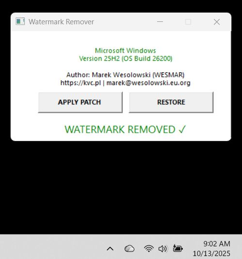

# Windows Watermark Remover

A lightweight Windows utility that removes the desktop watermark on evaluation and insider builds. Built with pure WinAPI and modern C++, resulting in a compact 40 KB executable.

## Features

- **Removes Windows watermarks** from desktop background
- **Automatic Explorer restart** for immediate effect - no logout required
- **TrustedInstaller integration** for system-level operations
- **Clean GUI interface** with real-time status display
- **Restore functionality** to revert changes
- **Minimal footprint** - only 40 KB executable size

## Technical Stack

- **Language**: Modern C++ (stdcpplatest)
- **API**: Pure Windows API (no external frameworks)
- **Architecture**: DLL proxy injection + Import Address Table (IAT) patching
- **Build System**: Visual Studio 2022 or higher

## How It Works

The tool operates through a sophisticated multi-layer approach:

1. **Proxy DLL Mechanism**: Creates `ExpIorerFrame.dll` (deliberate typo to avoid conflicts) that intercepts Windows Explorer calls
2. **IAT Patching**: Redirects `LoadString` and `ExtTextOut` API calls to custom implementations
3. **Watermark Detection**: Analyzes text strings against known Windows branding patterns
4. **TrustedInstaller Execution**: Leverages Windows TrustedInstaller service for system-level modifications
5. **Registry Modification**: Updates CLSID registry entries to load the proxy DLL

### Key Components

- **Explorerframe.cpp**: Proxy DLL with API interception
- **TrustedInstallerExecutor**: Token impersonation and privilege escalation
- **ResourceExtractor**: Embedded DLL extraction from executable resources

## Download

Download the latest release: [SignGuiPatcher.7z](https://github.com/wesmar/Watermark_Remover/releases/download/v1.0.0-Watermark_Remover/SignGuiPatcher.7z)

**Archive password**: `github.com`

## Usage

1. **Extract the archive** using password: `github.com`
2. **Run SignGuiPatcher.exe as Administrator** (required for system modifications)
3. Click **"APPLY PATCH"** to remove the watermark
4. Explorer will restart automatically - **no logout required**
5. Click **"RESTORE"** to revert to original state

### Status Indicators

- 🟢 **WATERMARK REMOVED ✓** - Patch successfully applied
- 🔴 **WATERMARK ACTIVE ✓** - Original state (watermark visible)
- ⚫ **UNKNOWN STATE** - Inconsistent system state

## Requirements

- Windows 10/11 (tested on latest builds 25H2 26200+)
- Administrator privileges
- x64 architecture

## Security Considerations

This tool requires elevated privileges and modifies system configuration. It:
- Uses TrustedInstaller service for legitimate system modifications
- Creates a proxy DLL in System32 directory
- Modifies COM object registration in the registry
- All changes are fully reversible via the "RESTORE" function
- Does not modify original Windows system files

## License

MIT License

Copyright (c) 2024 Marek Wesołowski (WESMAR)

Permission is hereby granted, free of charge, to any person obtaining a copy
of this software and associated documentation files (the "Software"), to deal
in the Software without restriction, including without limitation the rights
to use, copy, modify, merge, publish, distribute, sublicense, and/or sell
copies of the Software, and to permit persons to whom the Software is
furnished to do so, subject to the following conditions:

The above copyright notice and this permission notice shall be included in all
copies or substantial portions of the Software.

THE SOFTWARE IS PROVIDED "AS IS", WITHOUT WARRANTY OF ANY KIND, EXPRESS OR
IMPLIED, INCLUDING BUT NOT LIMITED TO THE WARRANTIES OF MERCHANTABILITY,
FITNESS FOR A PARTICULAR PURPOSE AND NONINFRINGEMENT. IN NO EVENT SHALL THE
AUTHORS OR COPYRIGHT HOLDERS BE LIABLE FOR ANY CLAIM, DAMAGES OR OTHER
LIABILITY, WHETHER IN AN ACTION OF CONTRACT, TORT OR OTHERWISE, ARISING FROM,
OUT OF OR IN CONNECTION WITH THE SOFTWARE OR THE USE OR OTHER DEALINGS IN THE
SOFTWARE.

## Author

**Marek Wesołowski (WESMAR)**
- Website: [kvc.pl](https://kvc.pl)
- Email: marek@wesolowski.eu.org
- GitHub: [@wesmar](https://github.com/wesmar)

## Disclaimer

The program does not modify any system files. It performs a single, reversible write to the Windows Registry (one byte / one character). The operation can be undone to restore the original registry value. Use responsibly; the author is not liable for any unintended consequences.

## Contributing

Contributions are welcome! Please feel free to submit pull requests or open issues for bugs and feature requests.

---

**Note**: This tool is intended for removing evaluation/insider watermarks on legitimate Windows installations. It is not a license bypass or piracy tool.